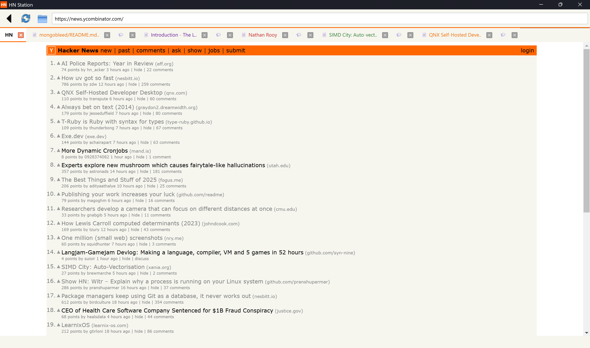

# HN Station 🍊

**The Browser for the 1%.**
A dedicated, keyboard-centric reading environment for Hacker News, built with Python & PyQt6.



## Why use this?
Reading Hacker News often involves opening multiple tabs for articles and comments, which quickly clutters your main browser and gets mixed up with your work emails and Jira tickets.

**HN Station** solves this by giving you a dedicated workspace for reading. It keeps your HN session separate from your daily work, organizes threads intelligently, and ensures you never lose your place—even if you restart your computer.

## Design Philosophy
* **Lightweight**: Built with Python & Qt6 (WebEngine) instead of Electron, making it RAM efficient.
* **Private**: No Google login, no telemetry, and no history syncing. Your reading habits stay local.
* **Polite**: Includes built-in rate limiting and retry logic to respect Hacker News' API.

## ⚡ Key Features

### 🚀 Smart "Dual Open"
Right-click any story on the home page and select **"Open Article & Comments"**. 
* Opens the article immediately in a new tab.
* Loads the HN comments in the **background** (delayed by 1.5s to prevent rate-limiting).
* **Auto-Grouping**: The Article and Comments share the same **Color Code** and are placed next to each other.

### 🎨 Visual Contexts
Tabs are automatically color-coded by "Thread."
* **Root Page**: Always 🍊 Orange.
* **Threads**: Opening a link starts a new "Color Group." All child tabs (comments, external links) inherit that color.
* **Smart Icons**: Tabs show 📄 for articles and 💬 for discussion threads automatically.

### ⌨️ Vim-Style Navigation
Navigate feeds without touching the mouse.
* `j` : Scroll Down
* `k` : Scroll Up
* `Ctrl+T` : New Tab
* `Ctrl+W` : Close Tab
* `Ctrl+L` : Focus Address Bar

### 💾 Smart Session Restore
* **Crash Proof**: Saves your open tabs every 5 seconds.
* **Focus Reset**: On restart, it automatically finds and focuses the "Home" tab so you can start fresh, while keeping your reading queue open in the background.
* **Auto-Retry**: If a page fails to load (e.g., network blip), it waits 2 seconds and retries automatically.

## Installation

### Option 1: The Installer (Windows)
Download the latest `HNStation-Setup.exe` from the releases page.

### Option 2: Run from Source

1.  **Clone:**
    ```bash
    git clone [https://github.com/rajeshkumarblr/myhn.git](https://github.com/rajeshkumarblr/myhn.git)
    cd myhn
    ```

2.  **Install dependencies:**
    ```bash
    pip install -r requirements.txt
    ```

3.  **Run:**
    ```bash
    python main.py
    ```

## Tech Stack
* **Core**: Python 3.10+
* **GUI**: PyQt6 (Qt 6.4+)
* **Engine**: QtWebEngine (Chromium)

---
*Built for the hackers, by a hacker.*